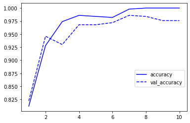
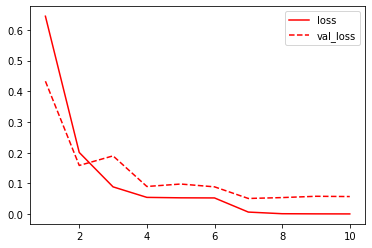

# Deep-Learning-Tutorial

 Deep Learning Pipeline from start to finish

 ## Project Description
In this Project I want to give a clear view of the How Deep Learning works from collecting Dataset to get actual results and predictions

## Steps
### Step 1
Importing data is the most important thing where you only have to create a folder called **Dataset** in a structure as follows:

* Dataset (Folder)
  * Class 1 (Folder)
  * Class 2 (Folder)

###### Example (File Tree):
./Dataset:
  * ./Dataset/0
    * image1.png
    * image2.png
    * .. ect

  * ./Dataset/1
    * image1.png
    * image2.png
    * .. ect

##### **Note** :
Name of the folder is the label of that class
### Step 2
Create Your Model Layers

###### Example (Model used in this tutorial)

Model Type : "sequential"

|       Layer (type)           |    Output Shape     | Param # |
|------------------------------|---------------------|---------|
|conv2d (Conv2D)|  (None, 268, 478, 8) |224  |
|max_pooling2d (MaxPooling2D)|  (None, 134, 239, 8)  |0  |
|conv2d_1 (Conv2D)|  (None, 134, 239, 8)  |1168  |
|max_pooling2d_1 (MaxPooling2D)|  (None, 66, 118, 16)   |0  |
|flatten (Flatten) | (None, 124608)      |0  |
|dense (Dense)  |  (None, 100)        |12460900  |
|dense_1 (Dense)   |   (None, 2)        |202  |

* Total params: 12,462,494
* Trainable params: 12,462,494
* Non-trainable params: 0

### Step 3
Plot your results of accuracy and lost

###### Example (My Results)
 **Note** :
This is My Results but note that you can do better if you found the Right Layers

* **Accuracy Results**

* **Loss Results**

### Detailed Review about the code
In this code you will find:

* **Function** `create_dataset` that reads your Dataset Folder Depending on how much class on your folder
  * **Output:**
    * your images as an array
    * array of labels (Depending on your folder name )

* **Function** `Shuffle in unison` shuffles two arrays in the same manner so we don't lose track of our labels

* **Model layers**
* **Saving Model history as Dictionary**
* **Plotting Dictionary Values:** to show the progress each epoch
